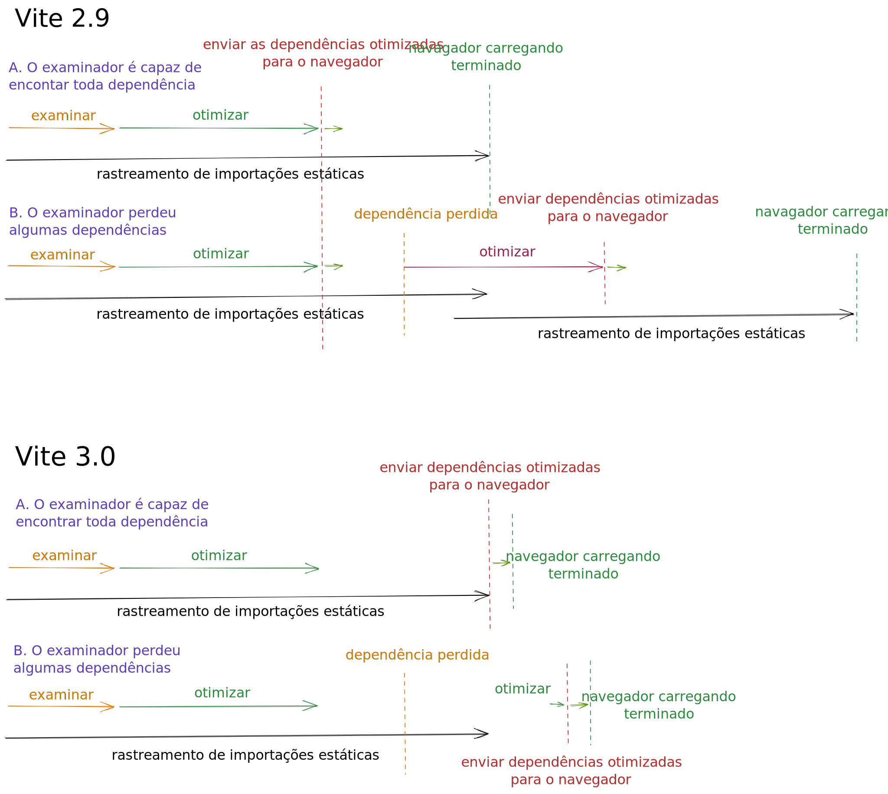

# A Vite 3.0 foi Publicada! {#vite-3-is-out}

_23 de Julho de 2022_ - Consultar o [anúncio da Vite 4.0](./announcing-vite4)

Em Fevereiro do ano passado, [Evan You](https://twitter.com/youyuxi) lançou a Vite 2. Desde então, sua adoção não tem parado de crescer, alcançando mais de 1 milhão de descarregamentos de npm por semana. Um ecossistema em crescimento desordenado formado rapidamente depois do lançamento. A Vite está alimentando uma renovada corrida de inovação nas abstrações de Web. A [Nuxt 3](https://v3.nuxtjs.org/) usa a Vite por padrão. A [SvelteKit](https://kit.svelte.dev/), [Astro](https://astro.build/), [Hydrogen](https://hydrogen.shopify.dev/), e a [SolidStart](https://docs.solidjs.com/quick-start) são todas construídas com a Vite. A [Lavavel decidiu agora usar a Vite por padrão](https://laravel.com/docs/9.x/vite). A [Vite Ruby](https://vite-ruby.netlify.app/) revela como a Vite pode melhorar a experiência de programação da Rails. A [Vitest](https://vitest.dev) está a fazer grandes progressos como uma alternativa nativa de Vite para a Jest. Vite está por detrás das funcionalidades de testagem de componente da [Cypress](https://docs.cypress.io/guides/component-testing/writing-your-first-component-test) e [Playwright](https://playwright.dev/docs/test-components), a Storybook tem a [Vite como um construtor oficial](https://github.com/storybookjs/builder-vite). E [a lista continua](https://patak.dev/vite/ecosystem.html). Os responsáveis pela maioria destes projetos envolveram-se no melhoramento do próprio núcleo da Vite, trabalhando intimamente com a [equipa](https://vite.dev/team) da Vite e outros colaboradores.


Hoje, 16 meses desde o lançamento da versão 2 estamos felizes em anunciar o lançamento da Vite 3. Nós decidimos lançar uma nova versão principal de Vite ao menos todos os anos para alinhar com a [EOL da Node.js](https://nodejs.org/en/about/releases/), e ter a oportunidade de revisar a API da Vite regularmente com um curto caminho de migração para os projetos no ecossistema.

Ligações rápidas:

- [Guia de Migração](https://v3.vite.dev/guide/migration.html)
- [Relatório de Mudança](https://github.com/vitejs/vite/blob/main/packages/vite/CHANGELOG.md#300-2022-07-13)

Se és recém-chegado na Vite, recomendamos a leitura do [Guia Porquê Vite](https://vite.dev/guide/why.html). Depois consulte [o Guia Começar](https://vite.dev/guide/) e o [Guia de Funcionalidades](https://vite.dev/guide/features) para veres o que a Vite fornece fora da caixa. Como de costume, as contribuições são bem-vindas na [GitHub](https://github.com/vitejs/vite). Mais de [600 colaboradores](https://github.com/vitejs/vite/graphs/contributors) têm ajudado a melhorar a Vite até aqui. Siga as atualizações na [Twitter](https://twitter.com/vite_js), ou junta-te as discussões com outros utilizadores da Vite no nosso [Servidor de Conversas da Discord](http://chat.vite.dev/).

## A Nova Documentação {#new-documentation}

Visite a [vite.dev](https://vite.dev) para apreciares a nova documentação da versão 3. A Vite agora está a usar a novo tema padrão da [VitePress](https://vitepress.vuejs.org), com um lindo modo escuro entre outras funcionalidades.

[](https://vite.dev)

Vários projetos no ecossistema já migraram para ela (veja a [Vitest](https://vitest.dev), [vite-plugin-pwa](https://vite-plugin-pwa.netlify.app/), e a própria [VitePress](https://vitepress.vuejs.org/)).

Se precisares de acessar a documentação da Vite 2, ela continua online [v2.vite.dev](https://v2.vite.dev). Existe também um novo subdomínio [main.vite.dev](https://main.vite.dev), onde cada envio para o ramo principal da Vite é implementada em produção automaticamente. Isto é útil quando se está a testar versões beta ou contribuir para desenvolvimento do núcleo.

Agora também existe uma tradução Espanhola oficial, que tem sido adicionada às anteriores traduções Chinesa e Japonesa:

- [简体中文](https://cn.vite.dev/)
- [日本語](https://ja.vite.dev/)
- [Español](https://es.vite.dev/)

## Criar Modelos de Partida da Vite {#create-vite-starter-templates}

Os modelos de partida de projeto da [create-vite](/guide/#trying-vite-online) têm sido uma excelente ferramenta para testar rapidamente a Vite com a tua abstração favorita. Na Vite 3, todos os modelos de projeto receberam um novo tema embutido de acordo com a nova documentação. Abra-os online e comece agora a brincar com a Vite 3:

<div class="stackblitz-links">
<a target="_blank" href="https://vite.new"></a>
<a target="_blank" href="https://vite.new/vue"></a>
<a target="_blank" href="https://vite.new/svelte"></a>
<a target="_blank" href="https://vite.new/react"></a>
<a target="_blank" href="https://vite.new/preact"></a>
<a target="_blank" href="https://vite.new/lit"></a>
</div>

<style>
.stackblitz-links {
  display: flex;
  width: 100%;
  justify-content: space-around;
  align-items: center;
}
@media screen and (max-width: 550px) {
  .stackblitz-links {
    display: grid;
    grid-template-columns: 1fr 1fr 1fr;
    width: 100%;
    gap: 2rem;
    padding-left: 3rem;
    padding-right: 3rem;
  }
}
.stackblitz-links > a {
  width: 70px;
  height: 70px;
  display: grid;
  align-items: center;
  justify-items: center;
}
.stackblitz-links > a:hover {
  filter: drop-shadow(0 0 0.5em #646cffaa);
}
</style>

O tema agora é partilhado por todos os modelos de projeto. Isto deve ajudar a expressar melhor as possibilidades destes pontos de partida como modelos minimalistas de projeto para começar com a Vite. Para soluções mais completas incluindo impressões sobre a qualidade do código, configuração de testes e outras funcionalidades, existem modelos de projetos oficiais alimentados pela Vite para algumas abstrações como [create-vue](https://github.com/vuejs/create-vue) e [create-svelte](https://github.com/sveltejs/kit). Existe uma lista mantida pela comunidade com modelos de projetos na [Awesome Vite](https://github.com/vitejs/awesome-vite#templates).

## Melhorias de Desenvolvimento {#dev-improvements}

### Interface da Linha de Comando da Vite {#vite-cli}

<pre style="background-color: var(--vp-code-block-bg);padding:2em;border-radius:8px;max-width:100%;overflow-x:auto;">
  <span style="color:lightgreen"><b>VITE</b></span> <span style="color:lightgreen">v3.0.0</span>  <span style="color:gray">ready in <b>320</b> ms</span>

  <span style="color:lightgreen"><b>➜</b></span>  <span style="color:white"><b>Local</b>:</span>   <span style="color:cyan">http://127.0.0.1:5173/</span>
  <span style="color:green"><b>➜</b></span>  <span style="color:gray"><b>Network</b>: use --host to expose</span>
</pre>

Para além dos aprimoramentos estéticos da Interface da Linha de Comando da Vite, notarás que a porta padrão do servidor de desenvolvimento agora é 5173 e o servidor de pré-visualização escuta na 4173. Esta mudança garante que a Vite evitará colisões com outras ferramentas.

### Estratégia Conexão de WebSocket Aperfeiçoada {#improved-websocket-connection-strategy}

Uma dos pontos dolosos da Vite 2 era a configuração do servidor quando estivesse a executar por trás de uma delegação (ou "proxy" em Inglês). A Vite 3 muda o esquema de conexão padrão assim funciona fora da caixa na maioria dos cenários. Todas estas configurações agora são testas como parte da Integração Contínua do Ecossistema da Vite através da [`vite-setup-catalogue`](https://github.com/sapphi-red/vite-setup-catalogue).

### Melhorias da Inicialização Fria {#cold-start-improvements}

Agora a Vite evita o recarregamento completo durante a inicialização fria quando as importações forem injetadas pelas extensões enquanto rastreia os módulos iniciais importados estaticamente ([#8869](https://github.com/vitejs/vite/issues/8869)).

<details>
  <summary><b>Clicar para aprender mais</b></summary>

Na Vite 2.9, ambos o examinador e otimizador eram executados no fundo. No melhor cenário, onde o examinador encontraria cada dependência, nenhum recarregamento era necessário na inicialização fria. Mas se o examinador deixar escapar uma dependência, uma nova fase de otimização e depois um recarregamento eram necessários. A Vite era capaz de evitar alguns destes recarregamentos na versão 2.9, conforme detetamos se os novos pedaços otimizados eram compatíveis com aqueles que o navegador tinha. Mas se houvesse uma dependência em comum, os sub-pedaços poderiam mudar e um recarregamento era exigido para evitar o estado duplicado. Na Vite 3, as dependências otimizadas não são passadas para o navegador até que o rastreamento das importações estáticas esteja terminado. Uma fase de otimização rápida é emitida se houver uma dependência em falta (por exemplo, injetada por uma extensão), e só então, as dependências empacotadas são enviadas. Então, um recarregamento de página já não é necessário ou nestes casos.

</details>



### import.meta.glob {#import-meta-glob}

O suporte ao `import.meta.glob` foi reescrito. Leia sobre as novas funcionalidades no [Guia de Importação de Glob](/guide/features.html#glob-import):

Os [Padrões Diversificado](/guide/features.html#multiple-patterns) podem ser passados como um arranjo:

```js
import.meta.glob(['./dir/*.js', './another/*.js'])
```

Os [Padrões Negativos](/guide/features.html#negative-patterns) agora suportados (prefixados com `!`) para ignorar alguns ficheiros específicos:

```js
import.meta.glob(['./dir/*.js', '!**/bar.js'])
```

As [Importações Nomeadas](/guide/features.html#named-imports) podem ser especificadas para melhorar a sacudidura de árvore:

```js
import.meta.glob('./dir/*.js', { import: 'setup' })
```

As [Consultas Personalizadas](/guide/features.html#custom-queries) podem ser passadas para atribuir meta-dados:

```js
import.meta.glob('./dir/*.js', { query: { custom: 'data' } })
```

As [Importações Incansáveis](/guide/features.html#glob-import) são agora passadas de acordo com uma opção:

```js
import.meta.glob('./dir/*.js', { eager: true })
```

### Alinhamento da Importação de WASM com Padrões Futuros {#aligning-wasm-import-with-future-standards}

A API de importação de WebAssembly tem sido revisada para evitar colisões com os padrões do futuro e para torná-la mais flexível:

```js
import init from './example.wasm?init'

init().then((instance) => {
  instance.exports.test()
})
```

Aprenda mais no [guia de WebAssembly](/guide/features.html#webassembly).

## Melhorias de Construção {#build-improvements}

### Construção de SSR de ESM por Padrão {#esm-ssr-build-by-default}

A maior parte das abstrações de interpretação no lado do servidor no ecossistema já estavam a usar as construções de módulos de ECMAScript. Então, a Vite 3 torna o módulo de ECMASCript o formato padrão para as construções da interpretação no lado do servidor (SSR, sigla em Inglês). Isto permite-nos agilizar as anteriores [heurísticas de exposição da interpretação no lado do servidor](https://vite.dev/guide/ssr.html#ssr-externals), expondo dependências por padrão.

### Suporte da Base Relativa Melhorado {#improved-relative-base-support}

Agora a Vite 3 suporta apropriadamente a base relativa (usando `base: ''`), permitindo que os recursos construídos sejam implementados em produção para diferentes bases sem reconstrução. Isto é útil quando a base não é conhecida no momento da construção, por exemplo quando estamos a implementando para redes de conteúdo endereçáveis como [IPFS](https://ipfs.io/).

## Funcionalidades Experimentais {#experimental-features}

### Controlo Afinado dos Caminhos dos Recursos Construídos (Experimental) {#built-asset-paths-fine-grained-control}

Há outros cenários de implementação de produção onde não é suficiente. Por exemplo, se recursos de nomes baralhados gerados precisarem ser implementados em produção para uma rede de entrega de conteúdo (CDN, sigla em Inglês) diferente da dos ficheiros públicos, então o controlo afinado é exigido sobre a geração de caminho no momento da construção. A Vite fornece uma API experimental para modificar os caminhos do ficheiro construído. Consulte as [Opções de Base Avançada da Construção](/guide/build.html#advanced-base-options) para mais informações.

### Otimização de Dependências da Esbuild no Momento da Construção (Experimental) {#esbuild-deps-optimization-at-build-time}

Umas das principais diferenças entre o momento da construção e o de desenvolvimento é como a Vite manipula as dependências. Durante o momento da construção, a extensão [`@rollup/plugin-commonjs`](https://github.com/rollup/plugins/tree/master/packages/commonjs) é usada para permitir apenas a importação de dependências CJS (como a React). Quando estiveres a usar o servidor de desenvolvimento, a esbuild é usada para pré-empacotar e otimizar as dependências, e um esquema de interoperabilidade embutido é aplicado enquanto estiver transformando o código do utilizador importando dependências de CJS. Durante o desenvolvimento da Vite 3, introduzimos as mudanças necessárias para também permitir o uso da [esbuild para otimizar as dependências durante o momento da construção](https://v3.vite.dev/guide/migration.html#using-esbuild-deps-optimization-at-build-time). A extensão [`@rollup/plugin-commonjs`](https://github.com/rollup/plugins/tree/master/packages/commonjs) pode então ser evitada, fazendo o trabalho em momento de desenvolvimento e construção caminhar na mesma direção.

Dado que a versão 3 da Rollup será publicada nos próximos meses, e estamos seguindo de perto com uma outra versão principal de Vite, decidimos tornar este modo opcional para reduzir o limite da versão 3 e dar a Vite e ao ecossistema mais tempo para trabalhar questões possíveis com a nova interoperabilidade de CJS durante o momento da construção. As abstrações podem alternar para usar a otimização de dependências da esbuild durante o momento da construção por padrão no seu ritmo antes da Vite 4.

### Aceitação Parcial da Substituição de Módulo Instantânea (Experimental) {#hmr-partial-accept}

Há suporte de optar pela [Aceitação Parcial da Substituição de Módulo Instantânea](https://github.com/vitejs/vite/pull/7324). Esta funcionalidade poderia desbloquear a Substituição de Módulo Instantânea (HMR, sigla em Inglês) afinada para componentes de abstração que exportam vários vínculos no mesmo módulo. Tu podes aprender mais [na discussão para esta proposta](https://github.com/vitejs/vite/discussions/7309).

## Redução do Tamanho do Pacote {#bundle-size-reduction}

A Vite cuida sua pegada de publicação e instalação; uma instalação rápida de uma nova aplicação é uma funcionalidade. A Vite empacota a maior parte de suas dependências e tenta usar alternativas modernas leves onde possível. Continuando com este objetivo em curso, o tamanho de publicação da Vite é 30% menor do que a versão 2.

|             | Tamanho de Publicação | Tamanho de Instalação |
| ----------- | :-------------------: | :-------------------: |
| Vite 2.9.14 |         4.38MB        |         19.1MB        |
| Vite 3.0.0  |         3.05MB        |         17.8MB        |
| Reduction   |          -30%         |          -7%          |

Em parte, esta redução foi possível tornando opcional algumas dependências que a maioria dos utilizadores não estavam a precisar. Primeiro, [Terser](https://github.com/terser/terser) já não é instalado por padrão. Esta dependência já não é necessária desde que tornamos a esbuild a minificadora padrão de ambos JavaScript e CSS na Vite 2. Se usas `build.minify: 'terser'`, precisarás de instalá-lo (`npm add -D terser`). Nós também movemos a [node-forge](https://github.com/digitalbazaar/forge) para fora do mono-repositório, implementando o suporte automático a geração de certificado de HTTPS como uma nova extensão: [`@vitejs/plugin-basic-ssl`](https://v3.vite.dev/guide/migration.html#automatic-https-certificate-generation). Já que esta funcionalidade apenas cria certificados não assegurados que não são adicionados ao armazenamento local, não justificava o tamanho adicionado.

## Correção de Bug {#bug-fixing}

Um maratona de triagem foi encabeçada pelos [@bluwyoo](https://twitter.com/bluwyoo), [@sapphi_red](https://twitter.com/sapphi_red), que recentemente juntaram-se a equipa da Vite. Durante os passados três meses, as questões abertas da Vite foram reduzidas de 770 para 400. E esta descida a pique foi alcançada enquanto os pedidos de atualização do repositório abertos recentemente estavam em uma altura sem precedentes. Ao mesmo tempo, [@haoqunjiang](https://twitter.com/haoqunjiang) tinha também curado uma compreensiva [visão de conjunto das questões da Vite](https://github.com/vitejs/vite/discussions/8232).

[](https://www.repotrends.com/vitejs/vite)

[](https://www.repotrends.com/vitejs/vite)

## Notas de Compatibilidade {#compatibility-notes}

- A Vite já não suporta as Node.js 12 / 13 / 15, as quais já alcançaram suas o fim de suas vidas. A Node.js 14.18+ / 16+ é agora obrigatória.
- A Vite é agora publicada como ESM, com uma delegação de CJS para a entrada de ESM por compatibilidade.
- A Base de Navegador Moderno agora aponta para navegadores que suportam os [módulos de ECMAScript nativo](https://caniuse.com/es6-module), [importações dinâmica do Módulo de ECMAScript nativo](https://caniuse.com/es6-module-dynamic-import), e as funcionalidades de [`import.meta`](https://caniuse.com/mdn-javascript_operators_import_meta).
- As extensões de ficheiro de JavaScript no modo de SSR e biblioteca agora usam uma extensão válida (`js`, `mjs`, ou `cjs`) para as entradas de JavaScript de saída e pedaços baseados no seu formato e o no tipo do pacote.

Aprenda mais no [Guia de Migração](https://v3.vite.dev/guide/migration.html).

## Atualizações para o Núcleo da Vite {#upgrades-to-vite-core}

Enquanto trabalhávamos em direção a Vite 3, também melhoramos a experiência de contribuição para os colaboradores do [Núcleo da Vite](https://github.com/vitejs/vite).

- Os testes Unitários e E2E têm sido migrados para [Vitest](https://vitest.dev), fornecendo uma uma experiência de programação mais rápida e estável. Este movimento também funciona como alimentação de cão para um projeto de infraestrutura importante no ecossistema.
- A construção da VitePress é agora testada como parte da CI.
- A Vite atualizada para [pnpm 7](https://pnpm.io/), seguindo resto do ecossistema.
- As Zonas de Experimentos tem sido movidas para [`/playgrounds`](https://github.com/vitejs/vite/tree/main/playground) fora do diretório dos pacotes.
- Os pacotes e as zonas de experimentos são agora `"type": "module"`.
- As extensões são agora empacotadas usando [unbuild](https://github.com/unjs/unbuild), e [plugin-vue-jsx](https://github.com/vitejs/vite-plugin-vue/tree/main/packages/plugin-vue-jsx) e [plugin-legacy](https://github.com/vitejs/vite/tree/main/packages/plugin-legacy) foi movida para TypeScript.

## O Ecossistema está Pronto para a Versão 3 {#the-ecosystem-is-ready-for-v3}

Nós trabalhamos bem de perto com os projetos no ecossistema para garantir que as abstrações alimentadas pela Vite estão prontas para a Vite 3. O [vite-ecosystem-ci](https://github.com/vitejs/vite-ecosystem-ci) permite-nos executar as CIs dos jogadores de destaque no ecossistema contra o ramo principal da Vite e receber relatórios oportunos antes da introdução de uma regressão. O lançamento de hoje em dia deve ser brevemente compatível com a maioria dos projetos usando a Vite.

## Agradecimentos {#acknowledgments}

A Vite 3 é o resultado do esforço agregado dos membros da [Equipa da Vite](/team) trabalhando em conjunto com os responsáveis do projeto do ecossistema e outros colaboradores do núcleo da Vite.

Nós queremos agradecer a todos que têm implementado funcionalidades, correções, dado reações, e têm se envolvido na Vite 3:

- Os membros da Vite [@youyuxi](https://twitter.com/youyuxi), [@patak_dev](https://twitter.com/patak_dev), [@antfu7](https://twitter.com/antfu7), [@bluwyoo](https://twitter.com/bluwyoo), [@sapphi_red](https://twitter.com/sapphi_red), [@haoqunjiang](https://twitter.com/haoqunjiang), [@poyoho](https://github.com/poyoho), [@Shini_92](https://twitter.com/Shini_92), e [@retropragma](https://twitter.com/retropragma).
- [@benmccann](https://github.com/benmccann), [@danielcroe](https://twitter.com/danielcroe), [@brillout](https://twitter.com/brillout), [@sheremet_va](https://twitter.com/sheremet_va), [@userquin](https://twitter.com/userquin), [@enzoinnocenzi](https://twitter.com/enzoinnocenzi), [@maximomussini](https://twitter.com/maximomussini), [@IanVanSchooten](https://twitter.com/IanVanSchooten), a [equipa da Astro](https://astro.build/), e todos os outros responsáveis de abstrações e extensões no ecossistema que ajudaram a moldar a versão 3.
- [@dominikg](https://github.com/dominikg) pelo seu trabalho na `vite-ecosystem-ci`
- [@dominikg](https://github.com/dominikg) pelo seu trabalho no [pnpm](https://pnpm.io/), e pela sua disponibilidade em responder quando precisávamos de suporte com ele.
- [@rixo](https://github.com/rixo) pelo suporte da Aceitação Parcial da HMR.
- [@KiaKing85](https://twitter.com/KiaKing85) por deixar o tema pronto para o lançamento da Vite 3, e [@\_brc_dd](https://twitter.com/_brc_dd) por trabalhar nos interiores da VitePress.
- [@CodingWithCego](https://twitter.com/CodingWithCego) pela nova tradução Espanhola, e [@ShenQingchuan](https://twitter.com/ShenQingchuan), [@hiro-lapis](https://github.com/hiro-lapis) e outros dentro das equipas de traduções do Chinês e Japonês por manterem as documentações traduzidas atualizadas.

Nós também queremos agradecer aos indivíduos e empresas patrocinando a equipa da Vite, e as empresas investindo no desenvolvimento da Vite: alguns dos trabalhos do [@antfu7](https://twitter.com/antfu7) sobre a Vite e o ecossistema é parte do seu trabalho na [Nuxt Labs](https://nuxtlabs.com/), e a [StackBlitz](https://stackblitz.com/) contratou o [@patak_dev](https://twitter.com/patak_dev) para trabalhar em tempo integral na Vite.

## Qual é o Próximo Passo {#what-is-next}

Levaremos os meses seguintes para garantir uma transição suave para todos os projetos construídos sobre a Vite. Então os primeiros esforços mínimos estarão concentrados em continuar a nossos trabalhos de triagem com um foco nas questões abertas recentemente.

A equipa da Rollup está a [trabalhar na sua próxima atualização principal](https://twitter.com/lukastaegert/status/1544186847399743488), para ser lançada nos próximos meses. Assim que o ecossistema de extensões de Rollup tiver tempo de atualizar, seguiremos com uma nova atualização principal. Isto dar-nos-á uma outra oportunidade de introduzir mudanças mais significativas este ano, o qual poderíamos encaminhar-nos para estabilizar algumas das funcionalidades experimentais introduzidas neste lançamento.

Se estiveres interessando em ajudar a melhorar a Vite, a melhor maneira de subir a bordo é ajudar com a triagem de problemas. Junta-te a [nossa Discord](https://chat.vite.dev) e procure pelo canal `#contributing`. Ou envolva-te em nosso `#docs`, `#help` outros, ou criar extensões. Nós estamos apenas a começar. Existem muitas ideias abertas para continuar a melhorar a experiência de programação da Vite.
